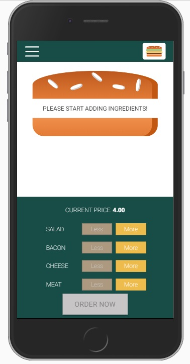
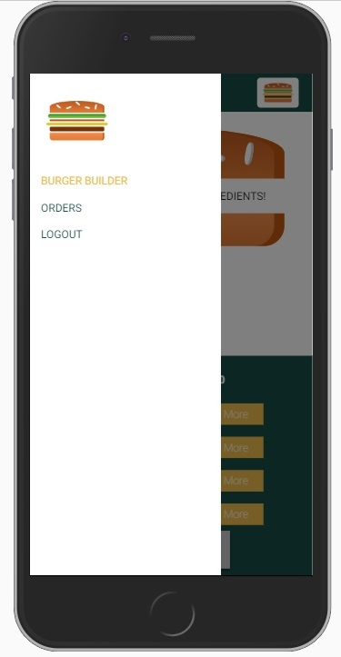
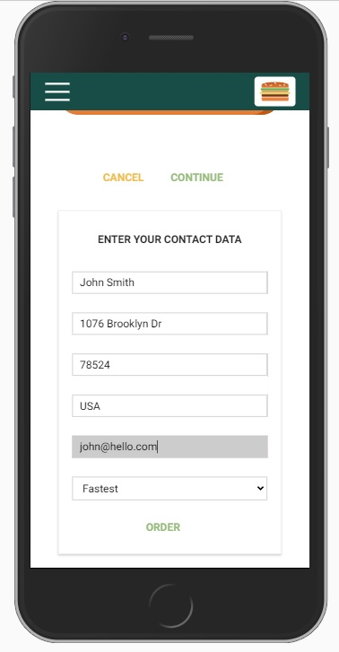

# Burger App 

## front-end solution for creating and ordering a burger

### // React.js, Redux, Firebase, Axios, Webpack //

## BurgerApp landing page

 

## Burger creation

 

### To Use 

run <i>npm install</i> and after <i> npm start </i>

Firebase database has been turned off, message me for more informations.  
Project has been developed during the React course.